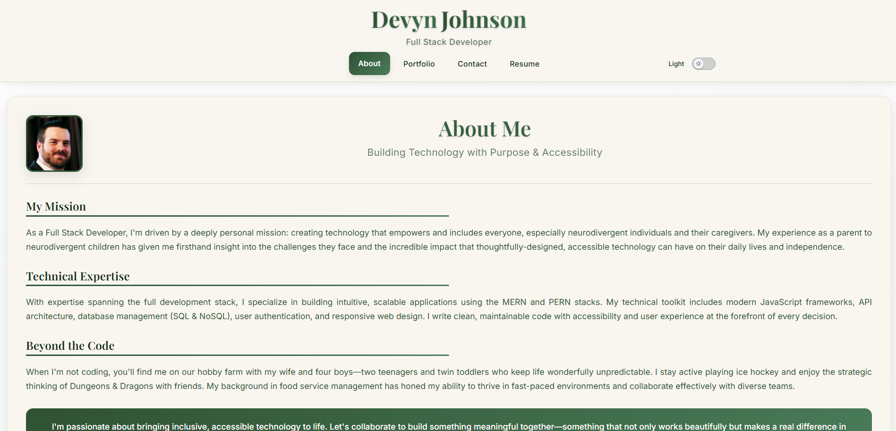
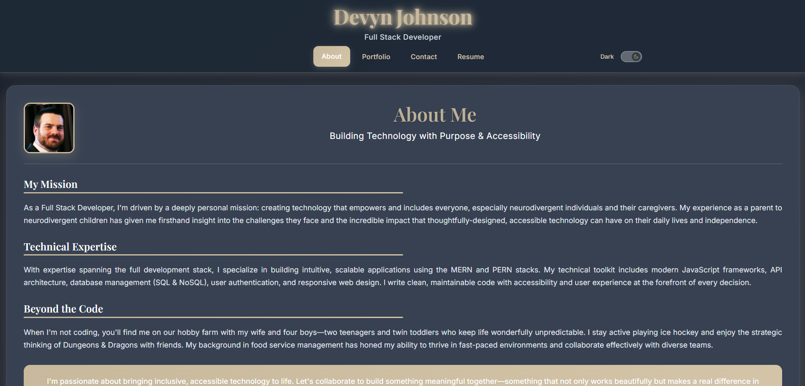

# portfolio [](https://opensource.org/licenses/MIT) [](https://app.netlify.com/sites/devynjohnsonportfolio/deploys)

## Description
A modern, responsive portfolio website showcasing my development projects, technical skills, and professional experience. Built with React and deployed on Netlify, this application serves as a comprehensive showcase for potential employers, clients, and the development community.

### 🌓 Light & Dark Mode Screenshots

<div align="center">

**Light Mode**


**Dark Mode**


</div>

## 🚀 Live Demo
Visit the live application at: [https://devynjohnson.me](https://devynjohnson.me)

## Installation

### For Viewing
No installation is required to use this application. It is designed to be accessed through a web browser at the live URL above.

### For Local Development
If you want to run this project locally or contribute to its development:

1. Clone the repository:
   ```bash
   git clone https://github.com/DevynJohnson/portfolio.git
   ```

2. Navigate to the project directory:
   ```bash
   cd portfolio/portfolio
   ```

3. Install dependencies:
   ```bash
   npm install
   ```

4. Start the development server:
   ```bash
   npm run dev
   ```

5. Open your browser and navigate to `http://localhost:3000`

## Usage
This portfolio website features:
- **About Me**: Professional background and personal interests
- **Portfolio**: Showcase of development projects with live demos and source code links
- **Resume**: Downloadable resume and professional experience
- **Contact**: Functional contact form powered by Formspree
- **Responsive Design**: Optimized for desktop, tablet, and mobile devices
- **Dark/Light Theme**: Toggle between theme preferences

## 🌟 Features
- Modern, responsive design that works on all devices
- Interactive project showcase with live demos
- Downloadable resume in PDF format
- Working contact form with email notifications
- Smooth animations and transitions
- SEO optimized
- Fast loading with Vite build optimization

## 🚀 Deployment
This application is automatically deployed to Netlify from the main branch. The deployment status can be monitored via the badge at the top of this README.

## 📁 Project Structure
```
portfolio/
├── public/           # Static assets
├── src/
│   ├── components/   # Reusable React components
│   ├── pages/        # Main application pages
│   ├── styles/       # CSS stylesheets
│   ├── data/         # Static data files
│   ├── contexts/     # React context providers
│   └── hooks/        # Custom React hooks
├── package.json      # Project dependencies
└── vite.config.js    # Vite configuration
```

## 👨‍💻 Author

**Devyn Johnson**
- GitHub: [@DevynJohnson](https://github.com/DevynJohnson)
- LinkedIn: [Devyn Johnson](https://www.linkedin.com/in/devyn-johnson-a5259213b)
- Portfolio: [devynjohnson.me](https://devynjohnson.me)

## 🛠️ Built With

### Core Dependencies

<ul>
<li><a href="https://www.npmjs.com/package/react">react</a></li>
<li><a href="https://www.npmjs.com/package/react-dom">react-dom</a></li>
<li><a href="https://www.npmjs.com/package/react-bootstrap">react-bootstrap</a></li>
<li><a href="https://www.npmjs.com/package/bootstrap">bootstrap</a></li>
<li><a href="https://www.npmjs.com/package/react-router-dom">react-router-dom</a></li>
<li><a href="https://www.npmjs.com/package/react-router-bootstrap">react-router-bootstrap</a></li>
<li><a href="https://www.npmjs.com/package/animate.css">animate.css</a></li>
<li><a href="https://www.npmjs.com/package/animate.css-react">animate.css-react</a></li>
</ul>

<p>### Development & Deployment Tools</p>
<ul>
<li><a href="https://vite.dev/">Vite</a> - Build tool and development server</li>
<li><a href="https://app.netlify.com/">Netlify</a> - Deployment and hosting platform</li>
<li><a href="https://formspree.io/">Formspree</a> - Contact form handling service</li>
<li><a href="https://eslint.org/">ESLint</a> - Code linting and quality assurance</li>
</ul>


## License
MIT License

Copyright (c) 2025 Devyn Johnson

Permission is hereby granted, free of charge, to any person obtaining a copy
of this software and associated documentation files (the "Software"), to deal
in the Software without restriction, including without limitation the rights
to use, copy, modify, merge, publish, distribute, sublicense, and/or sell
copies of the Software, and to permit persons to whom the Software is
furnished to do so, subject to the following conditions:

The above copyright notice and this permission notice shall be included in all
copies or substantial portions of the Software.

THE SOFTWARE IS PROVIDED "AS IS", WITHOUT WARRANTY OF ANY KIND, EXPRESS OR
IMPLIED, INCLUDING BUT NOT LIMITED TO THE WARRANTIES OF MERCHANTABILITY,
FITNESS FOR A PARTICULAR PURPOSE AND NONINFRINGEMENT. IN NO EVENT SHALL THE
AUTHORS OR COPYRIGHT HOLDERS BE LIABLE FOR ANY CLAIM, DAMAGES OR OTHER
LIABILITY, WHETHER IN AN ACTION OF CONTRACT, TORT OR OTHERWISE, ARISING FROM,
OUT OF OR IN CONNECTION WITH THE SOFTWARE OR THE USE OR OTHER DEALINGS IN THE
SOFTWARE.

